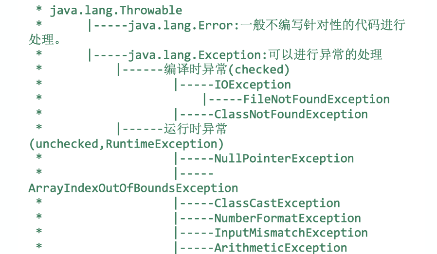

## 异常处理
### 1、异常体系结构

Throwable
----Error
----Exception
--------IOException
--------ClassNotFountException
--------CloneNotSupportException
--------RuntimeException
------------ClassCastException
------------IllegalStateException
------------IndexOutOfBoundsException
------------NullPointerException
### 2、解释编译时异常和运行是异常
- 运行时异常，java.exe 执行时出现的异常；
常见的运行时异常
ArrayIndexOutofBoundsException     数组越界异常 
ClassCastException                           类型转换异常 
NullPointerException                          空指针异常   
IllegalAccessException                      非法的参数异常 
InputMismatchException                    输入不匹配异常


- 编译时异常，javac.exe 执行时可能出现的异常； 把.java 程序 编译成 .class 文件时出现的异常；
常见的编译时异常：
IOException                            输入输出流异常 
FileNotFoundException          文件找不到的异常 
ClassNotFoundException       类找不到异常 
DataFormatException             数据格式化异常 
NoSuchFieldException           没有匹配的属性异常 
NoSuchMethodException       没有匹配的方法异常 
SQLException                         数据库操作异常 
TimeoutException                   执行超时异常


```java
IOException：广泛的说，什么时候会有IOException ，比如你文件都不到的时候 ，你在做数据库操作的时候数据库底层出现问题 ，或者你系统IO出问题了 ，系统拿不到文件句柄 ，你说的读着读着突然被删了，你可以试试，书不定真可以 ，你可以看有多少IOExeption个子类，差不多就有多少种类型。

FileNotFoundException：注意，这里的找不到是在你的编译结果文件夹里面找不到，而不是在你的工程里面找不到，很多同学说自己工程里面有这个文件，为什么还要报这个异常？这个时候，你最好跑到你的编译文件放的文件夹下面，比如tomcat的webapps文件夹下面，找找你的工程对应的文件夹，看看那个里面有没有你的文件

ClassNotFoundException：属于编译时异常，是在classloader加载类的时候发现类不存在在类路径的时候报出的。

SQLException：比如SQL语句写错，访问的表不存在，连接数据库失败等。
```

### 3、常见的异常，以及引起异常的相关例子

### 4、异常处理的方式；
常见的异常处理是采用抓-抛模型；
过程一：抛，程序在执行过程中，一旦出现异常，就会在异常代码处生成一个对应的异常类对象，并将此对象抛出，一旦抛出之后，次代码之后的代码就不在执行；
过程二：抓，可以理解为对异常的处理；try-catch-finally      throws

常见的对异常处理的方式有两种：
-  方式一：try-catch-finally
（1）使用try 将可能出现异常的，代码块包装起来，一旦出现异常，则生成一个异常对应的类对象，根据此对象的类型，在catch 中进行匹配处理；
（2）try中的异常对象匹配到某一个catch是，就会进入catch中进行异常处理，一旦处理完成，就睡跳出 try-catch 结构，继续执行后续代码；
注意：
（3）catch 中的exception 若是没有父子类关系，声明顺序无所谓，但是若是存在父子类关系，则子类一定要声明在父类的上面；
（4）finally 是一定会被执行的代码块，这里面一般放，数据库关闭操作，文件流的关闭，等等；

```java


    try {
        //可能出现异常的代码
        String s = " s1";
    } catch (Exception e) {
        // 处理异常对象
        e.printStackTrace();
    } finally {
        // 一定会执行的代码
    }

```
- 方式二： throws+异常类型
“ throws+异常类型”  写在方法声明处，指出该方法在执行时，可能会出现异常；方法执行，一旦出现异常，同样也会生成一个异常类，然后抛出，异常代码后续代码就不回被执行；

###  4、Throw 和Throws 的区别
throw表示抛出一个异常类的对象，生成异常对象的过程，生命在方法体内；
throws 属于异常处理的一种方式，生命在方法的声明处；


